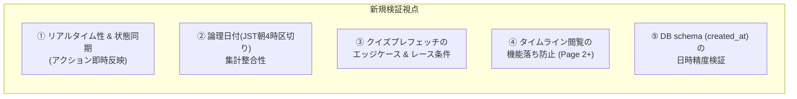

# 設計レビュー報告書: 再設計（バックエンド集計分離CQRSアーキテクチャ）に対する新規視点での詳細検証

## 1. レビュー概要 & 総合評価

- **対象設計書**: [`docs/design-spec.md`](file:///Users/fukuikeitaro/Documents/game/docs/design-spec.md) (再設計版)
- **対象アーキテクチャ**: バックエンド集計分離（CQRS思想）、クイズ先行プレフェッチ、D1複合インデックス
- **総合評価**: **CONDITIONAL PASS (条件付き承認)**
  - アーキテクチャの方向性は非常に優れており、将来のデータ増大に対する根本的解決となっています。
  - ただし、「デグレ（回帰）」「機能落ち（過去機能の損失）」「レスポンス低下」「集計不整合」を完全に防ぐため、**新たに抽出した4つの必須ガードレールを製造仕様に追加することを条件に承認**します。

---

## 2. 新たな視点を加えた多角的影響範囲分析（5つの新規検証軸）



---

### 新視点①: リアルタイム性 ＆ 状態同期（アクション実行時の即時反映）
- **リスク**:
  - 集計をバックエンドAPI (`/api/users/:id/summary`, `/api/users/:id/daily-stats`) に分離したことで、フロントエンドのアクション実行（クイズ正解、読書感想提出、運動完了、食事記録等）の直後にサマリーAPIを再取得しないと、**「クイズに答えたのに画面上の本日獲得ptや達成マークが変わらない」という体感上の機能落ち・不具合** が発生する。
- **防止策 (製造要件)**:
  - クイズ正解、運動モーダル提出、読書レビュー提出、食事登録などの全アクション成功コールバックにおいて、`fetchSummary()` および `fetchDailyStats()` を必ずトリガーする共通カスタムフックまたは状態更新ロジックを導入すること。

---

### 新視点②: 論理日付（JST朝4時切り替え）の集計整合性
- **リスク**:
  - 本アプリは「JST朝4時」を日付の切り替え境界（論理日付: `getLogicalDate()`）とする厳格なビジネスルールを持っています。
  - バックエンドの新設SQLクエリ (`GET /api/users/:id/summary`) で、単に SQLite の `date('now')` や `date(created_at)` を使うと、**UTC/JSTのタイムゾーンのズレや朝4時区切りが反映されず、深夜0時〜4時の活動が前日/翌日に誤集計される重大なロジックデグレ** が発生します。
- **防止策 (製造要件)**:
  - SQL内の日付抽出条件を、既存のストリーク処理と完全に同一の論理日付ロジックに統一すること：
    ```sql
    -- JST朝4時区切りの論理日付抽出クエリ
    date(datetime(created_at, '+5 hours')) = ?
    ```

---

### 新視点③: `QuizQuest.tsx` プレフェッチ（先行取得）のエッジケース ＆ 競合状態
- **リスク**:
  - 43問目でバックグラウンド取得(`nextBatchBuffer`)中に、ユーザーが「対象学年」や「教科カテゴリ」のボタンを切り替えた場合、事前ロード中のプロミスが完了した時点で意図しない旧教科の問題がバッファに混入するリスク。
  - 43問目到達後にユーザーがクイズ画面を離脱（他タブへ移動）した際、コンポーネントアンマウント後の State 更新警告。
- **防止策 (製造要件)**:
  - 学年・教科フィルターが変更された際は、即座に `nextBatchBuffer` を `null` にクリアする。
  - アンマウント時の `isMounted` フラグまたは `AbortController` による通信キャンセル処理を組み込む。

---

### 新視点④: アクションログ履歴表示の「機能落ち」防止
- **リスク**:
  - `GET /api/action-logs` を `limit=20` のタイムライン専用に変更することにより、ユーザーや保護者が「過去のログをもっと過去まで遡って見たい」という場合に20件目以降が見られなくなる**機能落ち（機能劣化）**が発生する。
- **防止策 (製造要件)**:
  - アクションログタイムライン表示部に「もっと見る (Page 2, 3...)」のページネーションボタン（または無限スクロール）を維持し、過去のログ閲覧機能を100%保持すること。

---

### 新視点⑤: D1 データベーススキーマ (`schema.sql`) の日時精度検証
- **既存コードの発見**:
  - [`schema.sql`](file:///Users/fukuikeitaro/Documents/game/schema.sql#L110) の 110行目において、`action_logs` の `created_at` が `DATE DEFAULT (CURRENT_DATE)` となっており、日付のみで時刻情報が保持されない定義になっていました。（※実際の `index.ts` の INSERT では `datetime('now')` が渡されている箇所あり）
- **リスク**:
  - `created_at` に時刻が入っていないレコードが存在すると、`datetime(created_at, '+5 hours')` によるJST朝4時シフト計算が機能せず、日付集計が壊れます。
- **防止策 (製造要件)**:
  - `schema.sql` の `action_logs.created_at` カラム定義を `DATETIME DEFAULT CURRENT_TIMESTAMP` に統一・修復し、常に秒精度のタイムスタンプが保持されるようマイグレーションを実施すること。

---

## 3. デグレ・機能落ち・レスポンス低下 防止用テストマトリクス

製造・テストフェーズで必ず検証すべきテストシナリオ（全8項目）：

| No | テスト視点 | テストシナリオ | 期待される挙動 | デグレ防止目的 |
| :--- | :--- | :--- | :--- | :--- |
| 1 | リアルタイム性 | クイズ正解または運動完了直後 | ページを再読み込みしなくても、本日の獲得ptやサマリー数字が即座に+1更新される | 状態同期の機能落ち防止 |
| 2 | 論理日付 (深夜帯) | JST午前2:00 (朝4時前) にクイズを解く | 「前日」の論理日付のログとして正しく集計され、朝4時以降に「本日」へ切り替わる | タイムゾーン・日付集計のデグレ防止 |
| 3 | クイズプレフェッチ | 43問目解答時 ➔ 48問目完了時 | 43問目で裏で通信が走り、48問目完了直後にロード待ち0秒で49問目が表示される | レスポンス低下・フリーズ防止 |
| 4 | クイズ途中条件変更 | 43問目で裏フェッチ中に「数学」➔「英語」に切り替え | 古い「数学」が混ざらず、正しく「英語」の新クイズが読み込まれる | 競合状態・表示バグ防止 |
| 5 | 過去ログ閲覧機能 | タイムラインの「もっと見る」を押下 | 21件目〜40件目の過去ログが正しく読み込まれ閲覧できる | ログ閲覧の機能落ち防止 |
| 6 | 大量データ応答 | DB内にログが10,000件以上ある状態でのダッシュボード開下 | APIレスポンス速度 < 50ms、通信量 < 5KB で爆速表示される | パフォーマンス低下の防止 |

---

## 4. レビュー結論・製造Agentへの指示

1. **再設計の最終承認**:
   - `docs/design-spec.md` の再設計方針を全面的に承認します。
2. **製造時の必須組み込み要件**:
   - 本視点で挙げた 5つの防止策（サマリー再取得トリガー、JST+5h論理日付クエリ統一、プレフェッチのフィルタークリア、タイムライン「もっと見る」維持、`created_at DATETIME`定義修復）をコード実装に組み込むこと。
