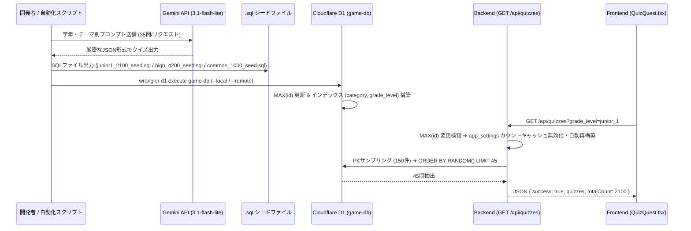

# 機能設計仕様書: クイズ問題の大量拡張（中1前半2,100問 / 高校全体4,200問 / 時事一般常識1,000問・全7,300問追加）

## 1. 概要・目的

現行のクイズプール（約1,500問）に対し、以下の目的で**合計7,300問の新規クイズ（全プール7,600問規模）**を追加・自動生成・D1データベースへロードする環境およびスクリプトを構築します。

1. **中学生向け (`junior_1`)**: 未習範囲を含めず、**「中1前半（1学期〜2学期前半レベル）」に限定した 2,100問（現行の5倍）**を新規作成。1日300問解いても約7日間一切被らず反復可能にします。
2. **高校生向け (`high_3`)**: 高3生の総復習・受験対策として**「高校全体（高1〜高3・共通テスト基礎）」で 4,200問（現行の5倍）**を新規作成。1日300問解いても約14日間被らず総復習可能にします。
3. **全世代共通 (`all`)**: 中学生・高校生・一般ユーザーが共通で楽しめる**「時事問題・ビジネスマナー・世界地理・雑学 1,000問」**を新規作成（`grade_level = 'all'` 指定）。学年を問わずランダム混雑出題可能とします。

---

## 2. システム要件 & データ構造

### 2.1 データモデル・スキーマ（`quiz_questions` テーブル）

既存の `schema.sql` における `quiz_questions` スキーマを変更することなく、データを追加投入します。

```sql
CREATE TABLE IF NOT EXISTS quiz_questions (
  id INTEGER PRIMARY KEY AUTOINCREMENT,
  grade_level TEXT NOT NULL,      -- 'junior_1' | 'high_3' | 'all' | 'other'
  category TEXT NOT NULL,         -- 'english' | 'math' | 'science' | 'social_studies' | 'japanese' | 'current_events' | 'anime_manga'
  question_text TEXT NOT NULL,     -- 問題文
  options_json TEXT NOT NULL,      -- 4択選択肢のJSON文字列 '["選択肢1", "選択肢2", "選択肢3", "選択肢4"]'
  correct_index INTEGER NOT NULL,  -- 正解インデックス (0~3)
  difficulty INTEGER DEFAULT 1,   -- 難易度 (1~3)
  created_at DATETIME DEFAULT CURRENT_TIMESTAMP
);
```

#### 学年設定 (`grade_level`) のルール:
- `junior_1`: 中1前半限定のクイズ（2,100問）
- `high_3`: 高校全範囲・共テ基礎のクイズ（4,200問）
- `all`: 全世代共通の時事・一般常識・雑学クイズ（1,000問）

---

### 2.2 データフロー & バックエンド動作機構



#### バックエンドにおける無変更互換性と動作仕様:
1. **自動カウントキャッシュ無効化 (`src/backend/index.ts:739-766`)**:
   - `SELECT MAX(id) FROM quiz_questions` をチェックし、シード投入で `MAX(id)` が跳ね上がった場合、`app_settings` 内のカウントキャッシュ (`quiz_count_${category}_${gradeLevel}`) を自動破棄して即座に最新件数に更新します。
2. **共通問題 (`grade_level = 'all'`) の自動混雑出題 (`src/backend/index.ts:718-721`)**:
   - `grade_level` フィルタ時に `(grade_level = ? OR grade_level = 'all')` となるため、時事問題・一般常識問題（1,000問）は全学年セッションにスムーズに組み込まれます。

---

## 3. スクリプト自動生成設計

大量の問題（計7,300問）を安全かつ高速に生成するため、以下の3つの独立スクリプトを構築します。

### 3.1 生成スクリプト一覧

1. **`scripts/generate_junior1_2100.mjs`**
   - 目的: 中1前半限定 2,100問の生成（60タスク × 35問）
   - 対象: 5教科（英語・数学・理科・社会・国語 各12タスク＝420問）
   - 出力: `junior1_2100_seed.sql`
2. **`scripts/generate_high_4200.mjs`**
   - 目的: 高校全体（高3復習） 4,200問の生成（120タスク × 35問）
   - 対象: 5教科（英語・数学・理科・社会・国語 各24タスク＝840問）
   - 出力: `high_4200_seed.sql`
3. **`scripts/generate_common_1000.mjs`**
   - 目的: 全世代共通時事一般常識 1,000問の生成（30タスク × 33〜34問）
   - 対象: 最新ニュース、マナー・常識、世界地理・文化、科学・健康雑学（`grade_level = 'all'`）
   - 出力: `common_1000_seed.sql`

### 3.2 スクリプト共通仕様
- **使用モデル**: `gemini-3.1-flash-lite`（または `gemini-2.0-flash-lite`）
- **プロンプト構造**: JSONスキーマ強制 (`responseMimeType: 'application/json'`)
- **エラーリトライ**: 最大3回リトライ＋リクエスト間2秒のウェイト処理
- **SQLクォート自動エスケープ**: シングルクォーテーション `'` を `''` に置換して文法エラーを防止

---

## 4. コンテンツカリキュラム詳細

### ① 中1前半限定クイズ（全 2,100問 / 60タスク / 各35問）
- **英語 (420問)**: ローマ字、be動詞(肯定/否定/疑問)、一般動詞(肯定/否定/疑問)、代名詞(主格/所有格/目的格/所有代名詞)、疑問詞(What/Who/Where/How)、複数形、日常英単語
- **数学 (420問)**: 正負の数(絶対値/加減/乗除/累乗/四則)、文字と式(規則/数量表現/式の値/加減/乗除)、一次方程式(移項/計算ドリル)
- **理科 (420問)**: 植物(花/葉茎根/観察/被子裸子/単子葉双子葉/光合成呼吸)、観察器具操作、物質と気体(有機無機/密度/気体発生/水溶液/濃度)
- **社会 (420問)**: 地理(6大陸3大洋/世界国々/領海時差/都道府県/地形気候)、歴史(旧石器/縄文/弥生/古墳/飛鳥/大化改新・奈良)
- **国語 (420問)**: 中1漢字(読み/書き/部首/同音異義/類義対義/四字熟語)、文法(単位/文節区切り/主述/修飾/独立接続)、慣用句・ことわざ

### ② 高校全体（高3復習）クイズ（全 4,200問 / 120タスク / 各35問）
- **英語 (840問)**: 重要英単語800、全英文法(仮定法/関係詞/分詞/助動詞等)、長文構文
- **数学 (840問)**: 数I・A(数と式/2次関数/図形計量/確率)、数II・B(式証明/複素数/図形方程式/三角指数対数/微積分/ベクトル/数列)
- **理科 (840問)**: 物理(力学/波動/電磁気)、化学(構成/中和/酸化還元/有機無機)、生物(細胞/遺伝子/恒常性/環境)
- **社会 (840問)**: 日本史(織豊〜幕末/近現代)、世界史(市民革命/大戦/現代史)、公共・政経(憲法/経済/国際政治)
- **国語 (840問)**: 現代文評論語彙、古文(単語300/助動詞識別/敬語)、漢文(句型/返り点/書き下し)

### ③ 全世代共通時事一般常識（全 1,000問 / 30タスク / 各33〜34問）
- **最新時事・ニュース (250問)**: 最新ニュース、新紙幣、大阪万博、SDGs、国連、能登半島地震・防災
- **ビジネス・常識マナー (250問)**: 敬語使い分け、冠婚葬祭・手紙マナー、お金(税金/保険/金利)、ITリテラシー
- **世界地理・文化・名所 (250問)**: 国旗首都、世界遺産・名所、世界文化・料理、日本地理雑学
- **科学・健康・雑学 (250問)**: 宇宙開発(SLIM/アルテミス)、科学現象のなぜ、人体・健康・カロリー、難読漢字・スポーツ雑学

---

## 5. 実装タスクチェックリスト

### フェーズ 1: 自動生成スクリプトの作成
- [ ] **タスク 1.1: 中1前半2,100問生成スクリプト作成 (`scripts/generate_junior1_2100.mjs`)**
  - 中1前半5教科×12タスク（計60プロンプト）を定義。
- [ ] **タスク 1.2: 高校全体4,200問生成スクリプト作成 (`scripts/generate_high_4200.mjs`)**
  - 高校5教科×24タスク（計120プロンプト）を定義。
- [ ] **タスク 1.3: 全世代共通時事1,000問生成スクリプト作成 (`scripts/generate_common_1000.mjs`)**
  - 時事一般常識4ジャンル×30タスク（`grade_level = 'all'`）を定義。

### フェーズ 2: クイズ生成とSQLシードファイルの作成
- [ ] **タスク 2.1: 中1前半2,100問のバッチ生成実行**
  - `node scripts/generate_junior1_2100.mjs` 実行 ➔ `junior1_2100_seed.sql` 出力。
- [ ] **タスク 2.2: 高校全体4,200問のバッチ生成実行**
  - `node scripts/generate_high_4200.mjs` 実行 ➔ `high_4200_seed.sql` 出力。
- [ ] **タスク 2.3: 全世代共通時事1,000問のバッチ生成実行**
  - `node scripts/generate_common_1000.mjs` 実行 ➔ `common_1000_seed.sql` 出力。

### フェーズ 3: D1データベースへのデータロード
- [ ] **タスク 3.1: ローカル D1 データベースへのシード実行**
  - `npx wrangler d1 execute game-db --local --file=./junior1_2100_seed.sql`
  - `npx wrangler d1 execute game-db --local --file=./high_4200_seed.sql`
  - `npx wrangler d1 execute game-db --local --file=./common_1000_seed.sql`
- [ ] **タスク 3.2: 本番（Remote）D1 データベースへのシード実行**
  - `npx wrangler d1 execute game-db --remote --file=./junior1_2100_seed.sql`
  - `npx wrangler d1 execute game-db --remote --file=./high_4200_seed.sql`
  - `npx wrangler d1 execute game-db --remote --file=./common_1000_seed.sql`

### フェーズ 4: 検証 & 品質確認
- [ ] **タスク 4.1: API動作・件数表示の検証**
  - クイズ一覧取得API (`GET /api/quizzes?grade_level=junior_1` および `high_3`) で表示件数が正しく無効化・更新されることを確認。
- [ ] **タスク 4.2: 出題範囲・内容の確認**
  - 中1生画面において中1前半問題と時事問題がバランス良くランダム抽出され、未習問題（中1後半〜中3）が含まれないことを検証。
