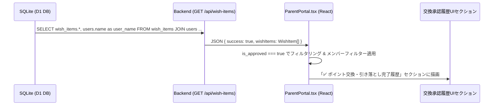

# 機能設計仕様書: 管理者ポータルにおけるポイント交換・ご褒美引き落とし履歴UIの再構築

## 1. 概要・目的

ユーザーより「ポイント交換の履歴が見える場所が無い気がする。管理者画面で見たい。」とのご要望を受け、現在 `ParentPortal.tsx`（管理者ポータル）内の「🎁 リクエスト & 履歴」タブ最下部に埋もれている **「✅ 交換の承認履歴」** セクションを、**大量のアクションログより上の目立つ位置に昇格・配置変更** します。
あわせて、メンバー（お子様）別の絞り込みフィルターや通算交換ポイント・現金額の集計表示を追加し、管理者（保護者）がご褒美交換履歴を直感的かつ即座に確認・管理できるようにUIを改善します。

---

## 2. 機能要件 & データ構造

### 2.1 機能要件
1. **交換履歴セクションの配置昇格**:
   - 管理者ポータルの「🎁 リクエスト & 履歴 (`requests_logs`)」タブ内において、**「① 未承認交換リクエスト」➔「② ✅ ポイント交換・引き落とし完了履歴」➔「③ アクション履歴（クイズ・運動等の行動ログ）」** の順序にレイアウトを再構成する。
2. **メンバー（お子様）別絞り込みフィルターの追加**:
   - 交換履歴エリアに「全員」「[メンバー名1]」「[メンバー名2]」などの切り替えフィルターを設置し、特定のお子様の交換履歴のみを抽出可能にする。
3. **通算ポイント・換金額集計バッジの強化**:
   - 選択されたフィルターに応じて、引き落とし済み合計ポイント数および現金換金達成額をリアルタイム集計して表示する。

### 2.2 データフロー全行程



1. **DBテーブル** (`wish_items`):
   - 使用カラム: `id`, `user_id`, `title`, `required_points`, `approved_points`, `item_type`, `is_approved`, `is_claimed`, `approved_at`, `created_at`
2. **バックエンド SQL SELECT 句** (`GET /api/wish-items` / `src/backend/index.ts:1259`):
   ```sql
   SELECT wish_items.*, users.name as user_name 
   FROM wish_items 
   JOIN users ON wish_items.user_id = users.id 
   ORDER BY wish_items.approved_at DESC, wish_items.required_points ASC
   ```
3. **API レスポンス** (`WishItem[]` 型 / `src/frontend/types.ts`):
   ```json
   {
     "success": true,
     "wishItems": [
       {
         "id": "wish_1786900000000_abc",
         "user_id": "user_1784723445812_y29a",
         "user_name": "シュンタロウ",
         "title": "図書カード 1,000円分",
         "required_points": 1000,
         "approved_points": 1000,
         "item_type": "goods",
         "is_approved": 1,
         "is_claimed": 1,
         "approved_at": "2026-08-18 19:30:00"
       }
     ]
   }
   ```
4. **フロント UI** (`ParentPortal.tsx`):
   - `wishItems.filter(item => item.is_approved)` で抽出。
   - メンバーフィルター (`selectedWishUserFilter`) による `user_id` 絞り込み。

---

## 3. UI / コンポーネント設計

### 3.1 「🎁 リクエスト & 履歴」タブのレイアウト変更

```
┌────────────────────────────────────────────────────────┐
│ 🎁 リクエスト & 履歴 タブ                                │
├────────────────────────────────────────────────────────┤
│ 【1】🎁 お子様からの交換リクエスト (承認・引き落とし待ち)│
│     (未承認のアイテムカード一覧)                       │
├────────────────────────────────────────────────────────┤
│ 【2】✅ ポイント交換・引き落とし完了履歴 (★ここへ移動)   │
│   ┌──────────────────────────────────────────────────┐ │
│   │ [全員] [シュンタロウ] [あこ] [チチ]   引き落とし合計: 2,500 pt │ │
│   └──────────────────────────────────────────────────┘ │
│   (承認済みアイテムカード・日時・引き落としpt表示)      │
├────────────────────────────────────────────────────────┤
│ 【3】📊 アクション履歴・行動ログ                        │
│   (クイズ・運動・食事などの日々の獲得ログ一覧)          │
└────────────────────────────────────────────────────────┘
```

### 3.2 ガードレール原則の適用
- **重複表示の事前点検**: 承認済み履歴のカード描画ロジックは既存のコンポーネントを活用・整理し、二重配置が発生しないよう「画面上部」へ1箇所のみ配置する。
- **デザインシステムの同調**: 背景色 (`slate-900/80`), 枠線 (`border-slate-800`), アクセントカラー (承認済み: `emerald-400`, ポイント: `amber-400`) は既存のコンポーネント定義と100%同期させる。

---

## 4. 実装タスクチェックリスト

- [x] **タスク 1: バックエンド並び順の最適化**
  - `src/backend/index.ts` の `GET /api/wish-items` のソート順を `approved_at DESC, created_at DESC`（最新の交換が一番上にくる順序）に改善する。
- [x] **タスク 2: `ParentPortal.tsx` のコンポーネント構造・状態整理**
  - 交換履歴用のメンバー絞り込みステート (`selectedWishUserFilter`) を追加。
- [x] **タスク 3: UIセクションの昇格・レイアウト更新**
  - `ParentPortal.tsx` 内の「✅ 交換の承認履歴」セクションを、アクティビティログの一覧より独立した見やすいレイアウトへ改修。
- [x] **タスク 4: メンバー別絞り込み・通算集計カードの実装**
  - 全員 / 各お子様のフィルターボタンと、選択されたメンバーの「通算引き落としポイント数」リアルタイム集計表示を実装。
- [x] **タスク 5: 動作検証・表示チェック**
  - 管理者ポータルでご褒美の承認・引き落としを実行し、交換履歴が即座に反映され、メンバー絞り込みが正常に機能することを検証する。
