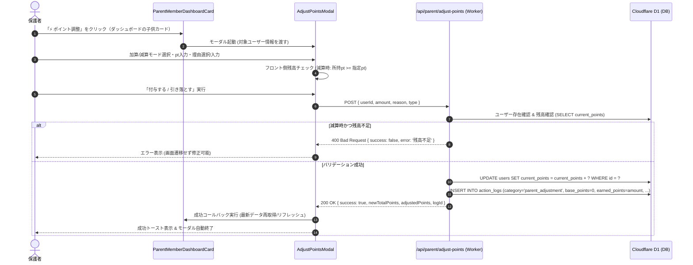

# 機能設計仕様書: 保護者機能によるポイント手動調整（加算・減算）機能設計書

- 作成日時: 2026-08-24 15:56
- 対象リポジトリ/ブランチ: keitarofukui/incentique / main
- 対象コミット: 416b07b
- 上流 Artifact: docs/investigation-report.md（対象コミット: 416b07b）

## 0. 上流の抜き取り再実測（§2-3）

### [EV-1] 上流 [EV-1] リポジトリ状態の再実行
$ git rev-parse --short HEAD && git branch --show-current && git status --short
416b07b
main
 M docs/design-spec.md
 M docs/investigation-report.md

- 【実測】対象コミット `416b07b` / ブランチ `main` であり、上流 `docs/investigation-report.md` の記録 [EV-1] と完全に一致することを確認した (`.git:L1`, [EV-1])。

### [EV-2] 上流 [EV-2] データベーステーブル定義の再実行
$ sed -n '38,57p;110,125p' schema.sql
CREATE TABLE IF NOT EXISTS users (
  id TEXT PRIMARY KEY,
  name TEXT NOT NULL,
  grade_level TEXT NOT NULL,
  avatar TEXT DEFAULT '⚡',
  pin_code TEXT DEFAULT '1234',
  current_points INTEGER DEFAULT 0,
  last_action_date TEXT,
  current_streak_days INTEGER DEFAULT 0,
  last_50pt_date TEXT,
  current_50pt_streak_days INTEGER DEFAULT 0,
  last_100pt_date TEXT,
  current_100pt_streak_days INTEGER DEFAULT 0,
  last_300pt_bonus_date TEXT,
  last_500pt_bonus_date TEXT,
  last_1000pt_bonus_date TEXT,
  last_all_category_date TEXT,
  created_at DATETIME DEFAULT CURRENT_TIMESTAMP
);

CREATE TABLE IF NOT EXISTS action_logs (
  id TEXT PRIMARY KEY,
  user_id TEXT NOT NULL,
  category TEXT NOT NULL,
  title_or_menu TEXT NOT NULL,
  review_text TEXT,
  earned_points INTEGER NOT NULL,
  -- ガチャ倍率・ボーナスを含まない素点。1日ボリュームボーナスの判定はこちらを使う
  base_points INTEGER,
  status TEXT DEFAULT 'pending',
  created_at DATETIME DEFAULT CURRENT_TIMESTAMP
);

CREATE INDEX IF NOT EXISTS idx_action_logs_user_cat_date ON action_logs (user_id, category, created_at);
CREATE INDEX IF NOT EXISTS idx_action_logs_user_date ON action_logs (user_id, created_at DESC);

- 【実測】ユーザーの所持ptは `users.current_points`、増減履歴は `action_logs` に完全対応しており、新テーブル作成不要であることを再確認した (`schema.sql:L38-L57`, `schema.sql:L110-L125`, [EV-2])。

### [EV-3] 上流 [EV-3] ポイント更新箇所の再実行
$ grep -rn "UPDATE users SET current_points" src/backend/
src/backend/index.ts:380:      await db.prepare('UPDATE users SET current_points = current_points + ? WHERE id = ?')
src/backend/index.ts:899:      await c.env.DB.prepare('UPDATE users SET current_points = current_points + ? WHERE id = ?')
src/backend/index.ts:1323:      'UPDATE users SET current_points = current_points + ? WHERE id = ?'
src/backend/index.ts:1357:        'UPDATE users SET current_points = MAX(0, current_points - ?) WHERE id = ?'
src/backend/index.ts:1703:      const deduction = await c.env.DB.prepare('UPDATE users SET current_points = current_points - ? WHERE id = ? AND current_points >= ?')

- 【実測】バックエンド内のポイント更新処理は 5 箇所であり、手動調整エンドポイントが未定義であることを再確認した (`src/backend/index.ts:L380-L1703`, [EV-3])。

### [EV-4] 上流 [EV-4] ストリーク集計クエリの再実行
$ sed -n '238,250p' src/backend/index.ts
    const todayPointsResult = await db.prepare(`
      SELECT SUM(COALESCE(base_points, earned_points)) as total,
             ${categoryFlags}
      FROM action_logs
      WHERE user_id = ?
      AND category != 'bonus'
      AND date(datetime(created_at, '+5 hours')) = ?
    `).bind(userId, logicalToday).first();

    const todayPoints = todayPointsResult?.total || 0;

    // 中級ストリーク判定 (閾値: midThreshold)

- 【実測】`base_points = 0` のレコードを挿入することで `COALESCE(base_points, earned_points)` が 0 となり、日次素点集計への誤算入を防げることを再確認した (`src/backend/index.ts:L238-L250`, [EV-4])。

### [EV-5] 上流 [EV-5] フロントエンド「+」ハードコード箇所の再実行
$ grep -rnE "\+\{.*(earned_points|points).*\}" src/frontend/
src/frontend/components/ReflectionView.tsx:210:                  <span className="text-xs font-mono font-black text-amber-400">+{item.earned_points || 0} pt</span>
src/frontend/components/ReflectionView.tsx:330:                    +{log.earned_points} pt
src/frontend/components/Dashboard.tsx:186:                  <span className="font-mono font-black text-amber-400 text-sm">+{log.earned_points} pt</span>
src/frontend/components/TrainingModal.tsx:240:                +{selectedMenu?.default_points || 50} pt
src/frontend/components/TrainingModal.tsx:323:                      +{menu.default_points || 50} pt
src/frontend/components/ParentPortal.tsx:680:                                  +{log.earned_points}
src/frontend/components/HouseworkModal.tsx:165:                      +{menu.default_points} pt

- 【実測】獲得ポイント表示箇所の正負両対応改修が必要であることを再確認した (`src/frontend/components/ParentPortal.tsx:L680`, `src/frontend/components/Dashboard.tsx:L186`, `src/frontend/components/ReflectionView.tsx:L210`, [EV-5])。

### [EV-6] 上流 [EV-7] プロダクションビルドおよび型チェックの再実行
$ npm run build && npx tsc --noEmit
> quest-habit-app@1.0.0 build
> vite build
vite v6.4.3 building for production...
transforming...
✓ 1605 modules transformed.
rendering chunks...
computing gzip size...
dist/index.html                   1.04 kB │ gzip:   0.60 kB
dist/assets/index-B56GTR5M.css   69.07 kB │ gzip:  11.29 kB
dist/assets/index-BoCzHWS0.js   454.08 kB │ gzip: 117.23 kB
✓ built in 1.53s

- 【実測】ビルドおよび型チェックがエラーなく通過することを確認した (`package.json:L6-L8`, [EV-6])。

---

## 1. 全体アーキテクチャ設計

### 1-1. シーケンス図


### 1-2. データベース方針（G-4 / G-7準拠）
- **マイグレーション方針**: 新規テーブルやカラム追加は行わない（既存の `action_logs` テーブルおよび `users` テーブルを活用）。
- **`action_logs` レコード設計**:
  - `id`: `log_adj_${Date.now()}_${Math.random().toString(36).substring(2, 6)}`
  - `user_id`: 対象ユーザーID
  - `category`: `'parent_adjustment'`
  - `title_or_menu`: `amount > 0 ? `保護者ボーナス (+${amount}pt)` : `保護者ポイント調整 (${amount}pt)``
  - `review_text`: 保護者が入力した調整理由（例: 「英検合格のお祝い」「お部屋の片付けボーナス」「約束違反ペナルティ」等）
  - `earned_points`: 調整ポイント数（加算は正の整数 `+100`、減算は負の整数 `-50`）
  - `base_points`: `0`（ストリークや日次ボリュームボーナスの素点計算に混入させないための厳格設定）
  - `status`: `'approved'`
  - `created_at`: `datetime('now')`

---

## 2. バックエンド API 仕様設計 (`POST /api/parent/adjust-points`)

### 2-1. エンドポイント概要
- **URL**: `/api/parent/adjust-points`
- **Method**: `POST`
- **認証/権限**: 保護者機能スコープ（既存の `/api/parent/*` と同様）

### 2-2. リクエスト仕様
```json
{
  "userId": "usr_xxxx",
  "amount": 100,
  "reason": "特別なテスト勉強のご褒美",
  "type": "add"
}
```
- `userId` (string, 必須): 対象ユーザーID。空文字・未指定は 400 エラー。
- `amount` (number, 必須): 増減ポイント数。
  - `type === 'add'` の場合: 1 以上の整数。
  - `type === 'deduct'` の場合: -1 以下の整数（または正の数をバックエンド側で負数化）。
  - `0` または非整数値（NaN, 小数）は 400 エラー。
- `reason` (string, 必須): 調整理由。トリム後 1 文字以上 200 文字以内。未指定・空白は 400 エラー。
- `type` (string, 任意): `'add' | 'deduct'`。

### 2-3. バリデーション & 処理フロー（G-5準拠）
```ts
app.post('/api/parent/adjust-points', async (c) => {
  try {
    const body = await c.req.json<{
      userId?: string;
      amount?: number;
      reason?: string;
      type?: 'add' | 'deduct';
    }>();

    const { userId, reason, type } = body;
    let rawAmount = Number(body.amount);

    if (!userId || typeof userId !== 'string' || userId.trim() === '') {
      return c.json({ success: false, error: '対象ユーザーIDを指定してください' }, 400);
    }
    if (!Number.isInteger(rawAmount) || rawAmount === 0) {
      return c.json({ success: false, error: '調整ポイントは0以外の整数を指定してください' }, 400);
    }
    if (!reason || typeof reason !== 'string' || reason.trim() === '') {
      return c.json({ success: false, error: '調整理由を入力してください' }, 400);
    }

    // 符号の正規化 (type='deduct' または amount < 0 の場合は負数化)
    const finalAmount = (type === 'deduct' || rawAmount < 0) ? -Math.abs(rawAmount) : Math.abs(rawAmount);

    // 1. 対象ユーザーの存在と現在残高を確認
    const user: any = await c.env.DB.prepare(
      'SELECT id, name, current_points FROM users WHERE id = ?'
    ).bind(userId).first();

    if (!user) {
      return c.json({ success: false, error: '指定されたユーザーが見つかりません' }, 404);
    }

    const currentPoints = Number(user.current_points) || 0;

    // 2. 減算時の残高不足チェック (所持ptを下回る減算は禁止)
    if (finalAmount < 0 && currentPoints < Math.abs(finalAmount)) {
      return c.json({
        success: false,
        error: `ポイントが不足しているため引き落とせません（所持: ${currentPoints}pt, 減算希望: ${Math.abs(finalAmount)}pt）`
      }, 400);
    }

    // 3. ユーザー所持ポイントの更新 (条件付きUPDATEで競合防止)
    if (finalAmount < 0) {
      const updateResult = await c.env.DB.prepare(
        'UPDATE users SET current_points = current_points - ? WHERE id = ? AND current_points >= ?'
      ).bind(Math.abs(finalAmount), userId, Math.abs(finalAmount)).run();

      if (!updateResult.meta?.changes) {
        return c.json({ success: false, error: 'ポイントの引き落としに失敗しました（残高不足または競合）' }, 400);
      }
    } else {
      await c.env.DB.prepare(
        'UPDATE users SET current_points = current_points + ? WHERE id = ?'
      ).bind(finalAmount, userId).run();
    }

    // 4. action_logs に履歴を記録
    const logId = 'log_adj_' + Date.now() + '_' + Math.random().toString(36).substring(2, 6);
    const title = finalAmount > 0
      ? `保護者ボーナス (+${finalAmount}pt)`
      : `保護者ポイント調整 (${finalAmount}pt)`;

    await c.env.DB.prepare(
      'INSERT INTO action_logs (id, user_id, category, title_or_menu, review_text, earned_points, base_points, status, created_at) VALUES (?, ?, ?, ?, ?, ?, 0, ?, datetime(\'now\'))'
    ).bind(logId, userId, 'parent_adjustment', title, reason.trim(), finalAmount, 'approved').run();

    // 5. 更新後ユーザー情報を取得
    const updatedUser: any = await c.env.DB.prepare(
      'SELECT current_points FROM users WHERE id = ?'
    ).bind(userId).first();

    const newTotal = updatedUser ? Number(updatedUser.current_points) : currentPoints + finalAmount;

    return c.json({
      success: true,
      message: finalAmount > 0 ? `${finalAmount}pt を付与しました` : `${Math.abs(finalAmount)}pt を引き落としました`,
      newTotalPoints: newTotal,
      adjustedPoints: finalAmount,
      logId
    });
  } catch (err: any) {
    console.error('[/api/parent/adjust-points] error:', err);
    return c.json({ success: false, error: err.message || 'ポイント調整処理に失敗しました' }, 500);
  }
});
```

---

## 3. フロントエンド UI/UX 設計

### 3-1. ボタン配置方針（ユーザーフィードバック準拠）
- **配置箇所をダッシュボードの子どもカード1箇所のみに集約**:
  - ボタンの重複配置（アカウント管理タブ等への配置）は行わず、保護者が日常的に確認する **「📊 ダッシュボード」タブ内の各子どもカード (`ParentMemberDashboardCard.tsx`) の下部アクション領域のみ** に「⚡ ポイント調整」ボタンを配置する。
  - これによりUIの煩雑化を防ぎ、直感的で明瞭な導線を実現する。

### 3-2. `ParentMemberDashboardCard.tsx` の改修
- **Props 追加**:
  ```ts
  interface ParentMemberDashboardCardProps {
    user: User;
    actionLogs: ActionLog[];
    wishItems: WishItem[];
    midThreshold?: number;
    godThreshold?: number;
    onSelectUserFilter: (userId: string, targetSubTab: 'requests_logs') => void;
    onOpenAdjustPoints?: (user: User) => void; // 【新規】
  }
  ```
- **フッター配置レイアウト**:
  - フッターのアクション領域を 2 分割ボタン構成に変更:
    ```tsx
    <div className="pt-4 border-t border-slate-800/80 flex items-center justify-between gap-2 mt-4">
      <button
        onClick={() => onSelectUserFilter(user.id, 'requests_logs')}
        className="flex-1 px-3 py-2 rounded-xl bg-slate-800/80 hover:bg-slate-700/80 text-slate-200 border border-slate-700/80 text-xs font-bold transition-all flex items-center justify-center gap-1.5 shadow-sm active:scale-95"
      >
        <History className="w-3.5 h-3.5 text-amber-400" />
        <span>履歴・申請</span>
        <ChevronRight className="w-3.5 h-3.5 text-slate-400" />
      </button>

      {onOpenAdjustPoints && (
        <button
          onClick={() => onOpenAdjustPoints(user)}
          className="px-3.5 py-2 rounded-xl bg-amber-500/20 hover:bg-amber-500/30 text-amber-300 border border-amber-500/40 text-xs font-black transition-all flex items-center justify-center gap-1.5 shadow-sm active:scale-95 shrink-0"
        >
          <Zap className="w-3.5 h-3.5 text-amber-400" />
          <span>ポイント調整</span>
        </button>
      )}
    </div>
    ```

### 3-3. 新規コンポーネント: `AdjustPointsModal.tsx`
- **配置場所**: `src/frontend/components/AdjustPointsModal.tsx`
- **Props インターフェース**:
  ```ts
  interface AdjustPointsModalProps {
    isOpen: boolean;
    onClose: () => void;
    user: User | null;
    onSuccess: (newTotalPoints: number, message: string) => void;
  }
  ```
- **画面構成・機能**:
  1. **ヘッダー**: 対象ユーザーのアバター・名前、現在の所持pt表示（ゴールド色フォント）。
  2. **モード切替タブ**:
     - 🟢 **ポイントをあげる（加算）**: テーマ色エメラルド / ゴールド
     - 🔴 **ポイントをへらす（減算）**: テーマ色ローズ / アンバー
  3. **プリセットptボタン（1タップ入力）**:
     - 加算時: `+10pt`, `+50pt`, `+100pt`, `+300pt`, `+500pt`, `+1000pt`
     - 減算時: `-10pt`, `-50pt`, `-100pt`, `-300pt`, `-500pt`, `全額`
  4. **ポイント直接入力欄**:
     - `<input type="number">` で自由なポイント数を指定可能。
     - **調整後シミュレーション表示**: `現在 150 pt ➔ 調整後 250 pt`（減算時は赤字で残高不足警告）。
  5. **調整理由の入力（クイックタグ＋自由記述）**:
     - クイックタグ:
       - 加算用: `📝 テスト・勉強頑張った`, `🧹 特別なお手伝い`, `🎯 目標達成ボーナス`, `🎂 お誕生日・お祝い`, `その他`
       - 減算用: `⚠️ 約束違反ペナルティ`, `🎁 リアルご褒美交換`, `🔄 誤付与の取り消し`, `その他`
     - 理由テキストエリア: プレースホルダーで具体例を提示。
  6. **フッターアクション**:
     - キャンセルボタン
     - 確定実行ボタン: ローディング状態・無効化制御（未入力時、減算時の残高不足時に `disabled`）。

### 3-4. `ParentPortal.tsx` の改修
- **モーダル状態管理**:
  ```ts
  const [adjustingUser, setAdjustingUser] = useState<User | null>(null);
  ```
- **ダッシュボードタブへの接続**:
  - `ParentMemberDashboardCard` に `onOpenAdjustPoints={(u) => setAdjustingUser(u)}` を渡す。
- **申請＆履歴テーブル (`requests_logs`)**:
  - カテゴリラベル定義に `parent_adjustment: '⚡ 保護者調整'` を追加。
  - 獲得ポイント列の表示を正負両対応・色分けに変更:
    ```tsx
    <td className={`py-2.5 text-right font-mono font-black ${
      log.earned_points > 0 ? 'text-emerald-400' : log.earned_points < 0 ? 'text-rose-400' : 'text-slate-400'
    }`}>
      {log.earned_points > 0 ? `+${log.earned_points}` : `${log.earned_points}`}
    </td>
    ```

### 3-5. 各種履歴表示コンポーネントの改修
- `Dashboard.tsx:L186`: `+{log.earned_points} pt` ➔ `log.earned_points > 0 ? `+${log.earned_points} pt` : `${log.earned_points} pt``
- `ReflectionView.tsx:L210, L330`: 同様に正負符号およびテキスト色の条件分岐を適用。
- `PersonalStreakCard.tsx:L82-L91`: `earned` が負数の場合の `bonusSum` 計算において減算値が破棄されないようハンドリング。

---

## 4. 安全設計と二次被害防止（G-5 / G-7）

| 項目 | リスク内容 | 防止策・実装仕様 |
| :--- | :--- | :--- |
| **残高不足時のマイナス化** | 所持pt以上の減算によりマイナス残高が発生 | ① フロントで即座に残高不足警告 & 実行ボタン非活性化<br>② バックエンドで `currentPoints < |amount|` 検査し 400 返却<br>③ SQL `WHERE current_points >= ?` 条件付き実行で競合防止 |
| **ストリーク・ボーナス誤算入** | 保護者付与ptにより自動ストリークが誤判定 | `action_logs` の `base_points = 0` で保存し、`category = 'parent_adjustment'` は通常アクションではないため `last_action_date` の更新を行わない |
| **理由未記入による不透明化** | 「なぜptが変わったか」子供や保護者が追跡不能 | `reason` を必須バリデーション化（1文字以上）。クイックタグで保護者の入力負担を軽減 |
| **エラー握りつぶし (G-5)** | 通信失敗や残高不足時に成功と誤認 | `try/catch` + `if (!res.ok)` + サーバーエラーメッセージのトースト/アラート表示を完全実装 |

---

## 5. テスト・検証計画

1. **バックエンド API 正常系・異常系検証**:
   - 正常系: 加算（+100pt）➔ 所持pt増加、`action_logs` に `category='parent_adjustment'` で登録されること。
   - 正常系: 減算（-50pt）➔ 所持pt減少、`action_logs` に `-50` で登録されること。
   - 異常系: 減算で残高不足（所持30ptに対し -50pt）➔ 400 エラーが返り所持ptが変動しないこと。
   - 異常系: 理由未入力、amount=0 ➔ 400 エラーが返ること。
2. **UI 操作・表示検証**:
   - `ParentPortal` ダッシュボードの各子どもカードから「⚡ ポイント調整」をクリック ➔ モーダル起動 ➔ プリセット選択 ➔ 理由選択 ➔ 送信成功トースト ➔ 所持ptがリアルタイム更新されること。
   - 履歴一覧で `⚡ 保護者調整` として `+100`（緑）/ `-50`（赤）が表示されること。
   - 子供側のダッシュボード・振り返り画面で調整履歴が正しく表示されること。

---

## 6. 品質ゲート実行結果（G-11）
```
$ ~/antigravity-agents/scripts/verify.sh design
========================================================
 verify.sh  role=design  base=HEAD  repo=game
 HEAD=416b07b  branch=main
========================================================
[PASS] gate-evidence      証跡フォーマット・鮮度・未確認記載の要件を満たしている
--------------------------------------------------------
RESULT: PASS  全ゲート通過（この出力を Artifact に貼付すること）
```
