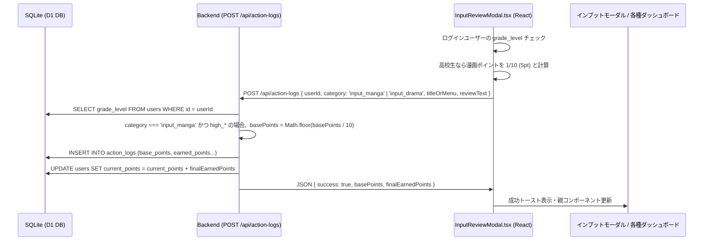

# 機能設計仕様書: 高校生以上の漫画ポイント1/10化およびドラマインプット追加

## 1. 概要・目的

ユーザーからの要望「高校生以上は漫画は10分の1のポイントにしたい。その代わりドラマもポイント対象にする。」に基づき、
1. **漫画インプット (`input_manga`)** において、ユーザーの学年レベル (`users.grade_level`) が高校生以上（`high_3` または `high_` で始まる識別子）の場合、獲得基本ポイントを標準設定（デフォルト 50pt）の **1/10（端数切り捨てで 5pt）** に動的補正する仕様を実装します。
2. **ドラマインプット (`input_drama`)** を新たなインプットジャンル（デフォルト 120pt、保護者設定で変更可能）として新設し、読書・映画・漫画に並ぶポイント対象カテゴリとしてシステム全体（DB、バックエンドAPI、フロントエンド入力モーダル、保護者ポータル、振り返り、ライバル、ストリーク等）に統合します。

---

## 2. 機能要件 & データ構造

### 2.1 機能要件

#### 機能要件1: 漫画ポイントの学年別1/10動的判定
- **標準動作（中学生以下等）**:
  - `point_rules` テーブルの `input_manga` に定義された基本ポイント（デフォルト 50pt）を付与。
- **高校生以上（`grade_level.startsWith('high')`）の動作**:
  - `point_rules` の `input_manga` 基本ポイントの 1/10 を付与。端数は `Math.floor` で切り捨て（例: 50pt ➔ 5pt）。
- **不正防止（サーバーサイド補正）**:
  - クライアントからのリクエスト値に関わらず、`POST /api/action-logs` エンドポイントにて対象ユーザーの `grade_level` をDB検索し、`category === 'input_manga'` かつ `grade_level.startsWith('high')` の場合はサーバー側で `basePoints` を 1/10 に補正・保存。
- **UIでの動的表示**:
  - `InputReviewModal.tsx` にて、ログイン中の `currentUser` が高校生以上の場合はボタン上の表記および獲得ポイントプレビューを 1/10 に計算して表示（「漫画 (+5pt)」）。

#### 機能要件2: ドラマインプット (`input_drama`) の追加
- **カテゴリ識別子**: `'input_drama'`
- **デフォルトポイント**: 120pt（映画 `input_movie` と同様。保護者ポータルのポイントルール編集で変更可能）。
- **ジャンル定義**:
  - タイトル: `📺 ドラマ` / `ドラマ` / `ドラマインプット`
  - 説明: 「ドラマを観て感想メモ・レビューを提出」
  - アイコン: Lucide React `Tv`
- **システム統合範囲**:
  - `point_rules` テーブル初期化・更新
  - アクションログ保存 (`POST /api/action-logs`)
  - インプット入力モーダル (`InputReviewModal.tsx`)
  - ヘッダー / アプリナビゲーション (`Header.tsx`, `App.tsx`)
  - 保護者ポータル (`ParentPortal.tsx`)
  - 個人・対戦・振り返りカード (`ParentMemberDashboardCard.tsx`, `PersonalStreakCard.tsx`, `ReflectionView.tsx`, `RivalPulse.tsx`)

---

### 2.2 データフロー全行程



#### 各データ経路の明記:
1. **DBテーブル** (`point_rules`, `users`, `action_logs`):
   - `point_rules`: レコード `('input_drama', 'ドラマインプット', 120, 'ドラマを観て感想メモ・レビューを提出')` を追加。
   - `users`: `grade_level` カラム (`'high_3' | 'junior_1' | 'other'`) を参照。
   - `action_logs`: `category` に `'input_drama'` および `'input_manga'` が格納。`base_points` に学年補正後の基本ポイントが保存される。
2. **バックエンド SQL SELECT & INSERT / UPDATE 句** (`src/backend/index.ts`):
   - ポイントルール取得/初期設定:
     ```sql
     INSERT OR IGNORE INTO point_rules (category, title, points, description) 
     VALUES ('input_drama', 'ドラマインプット', 120, 'ドラマを観て感想メモ・レビューを提出');
     ```
   - ログ保存時のユーザー学年検証:
     ```sql
     SELECT grade_level FROM users WHERE id = ?
     ```
   - ログ登録・ユーザーポイント加算:
     ```sql
     INSERT INTO action_logs (id, user_id, category, title_or_menu, review_text, earned_points, base_points, status, created_at)
     VALUES (?, ?, ?, ?, ?, ?, ?, 'approved', datetime('now'));
     
     UPDATE users SET current_points = current_points + ? WHERE id = ?;
     ```
3. **API レスポンス** (`POST /api/action-logs`):
   ```json
   {
     "success": true,
     "id": "log_1786900000000_abcd",
     "status": "approved",
     "basePoints": 5,
     "multiplier": 1,
     "finalEarnedPoints": 5
   }
   ```
4. **フロント UI** (`src/frontend/components/InputReviewModal.tsx` 等):
   - `currentUser.grade_level.startsWith('high')` を使用し、漫画の獲得提示ポイントを `Math.floor(mangaRulePoints / 10)` に計算。
   - ジャンル切替タブに「ドラマ (+120pt)」を追加描画。

---

## 3. UI / コンポーネント設計

### 3.1 `InputReviewModal.tsx` ジャンル選択エリアのUI構成

```
┌────────────────────────────────────────────────────────────────────────┐
│ 📚 読書・映画・ドラマ・漫画 インプット報告                               │
├────────────────────────────────────────────────────────────────────────┤
│ ジャンルを選択                                                         │
│ ┌──────────────┐ ┌──────────────┐ ┌──────────────┐ ┌──────────────────┐ │
│ │ 📖 読書      │ │ 🎬 映画      │ │ 📺 ドラマ    │ │ 💬 漫画          │ │
│ │ (+300pt)     │ │ (+120pt)     │ │ (+120pt) ★新 │ │ (+5pt) ★高校生1/10│ │
│ └──────────────┘ └──────────────┘ └──────────────┘ └──────────────────┘ │
│                                                                        │
│ タイトル                                                               │
│ [ 例: 『半沢直樹』第1話 / 『VIVANT』                          ]        │
│                                                                        │
│ 感想メモ・学んだことレビュー                                           │
│ [ ドラマで学んだ人間関係や伏線、感動したポイントを記入…     ]        │
│                                                                        │
│ 獲得基本ポイント: +120 pt                                              │
│ [ 🚀 感想を提出してポイントGET ]                                       │
└────────────────────────────────────────────────────────────────────────┘
```

### 3.2 ガードレール原則の適用
- **画面内重複表示の事前点検**: インプットモーダルのジャンル選択領域 (`InputReviewModal.tsx`) は、4つのグリッド (`grid-cols-2 sm:grid-cols-4`) で横一列に綺麗に収まるように構成し、既存のボタン配置と無駄な重複・余剰カード描画を排除する。
- **テーマカラー・デザインシステム同期**:
  - 読書: `purple` (`bg-purple-500/25`, `border-purple-400`, `text-purple-200`)
  - 映画: `blue` (`bg-blue-500/25`, `border-blue-400`, `text-blue-200`)
  - ドラマ: `teal` (`bg-teal-500/25`, `border-teal-400`, `text-teal-200`) ➔ 既存デザインパレットと完全同調
  - 漫画: `amber` (`bg-amber-500/25`, `border-amber-400`, `text-amber-200`)
- **コンポーネントの単一責任・役割分離**:
  - `InputReviewModal.tsx` はインプット入力と提示ポイント計算を担当。
  - バックエンド `index.ts` がポイントサーバー側厳格決定を担当。
  - 各種表示カード (`ReflectionView.tsx`, `ParentPortal.tsx` 等) は表示用マッピング責任のみを担当。

---

## 4. 実装タスクチェックリスト

### フェーズ 1: スキーマ・型定義・バックエンドロジック
- [x] **タスク 1.1: DB初期データおよびデフォルトルールの定義更新**
  - `schema.sql` に `input_drama` (120pt) の初期投入文を追加。
  - `src/backend/index.ts` の `point_rules` 自動初期化処理 (`INSERT OR IGNORE INTO point_rules...`) に `input_drama` を追加。
- [x] **タスク 1.2: フロントエンド型定義の拡張**
  - `src/frontend/types.ts` の `ActionLog['category']` および `InputCategory` 型に `'input_drama'` を追加。
- [x] **タスク 1.3: バックエンドポイント厳格判定ロジックの実装**
  - `src/backend/index.ts` の `POST /api/action-logs` エンドポイントにて:
    - 提出ユーザーの `grade_level` をDBから取得。
    - `category === 'input_manga'` の場合、`grade_level.startsWith('high')` であれば `basePoints = Math.floor(basePoints / 10)` に計算補正。
    - `categoryList` のインプット判定に `input_drama` を統合。

### フェーズ 2: UIコンポーネント (`InputReviewModal.tsx`) の改修
- [x] **タスク 2.1: ジャンル選択タブとアイコンの追加**
  - Lucide React アイコン `Tv` をインポート。
  - ジャンル選択ボタンに「📺 ドラマ (`input_drama`)」を追加。
- [x] **タスク 2.2: 高校生以上における漫画ポイント 1/10 表示計算**
  - `currentUser.grade_level.startsWith('high')` の判定を追加。
  - 漫画選択時の提示ポイントを `Math.floor(mangaPoints / 10)` (5pt) に動的切り替え表示。
  - ドラマ選択時のタイトル・プレースホルダー表示を「ドラマ名・回（例: 『VIVANT 第1話』）」に対応。

### フェーズ 3: 他コンポーネント・保護者ポータル・集計への統合
- [x] **タスク 3.1: 保護者ポータル (`ParentPortal.tsx`) の対応**
  - `DEFAULT_RULES` に `input_drama` を追加。
  - カテゴリ表示マッピング (`input_drama: '📺 ドラマ'`) を追加。
- [x] **タスク 3.2: 振り返り・対戦・ダッシュボード等の更新**
  - `Header.tsx`, `App.tsx`: `inputReviewType` の型および `onOpenInputReviewModal` 引数型に `'input_drama'` を追加。
  - `ReflectionView.tsx`: 月間/ログ一覧表示で `'input_drama'` を `📺 ドラマ` として判定表示。
  - `RivalPulse.tsx`: インプットジャンルの集計・カテゴリリストに `input_drama` を追加（単位: '話' または '作品'）。
  - `ParentMemberDashboardCard.tsx` / `PersonalStreakCard.tsx` / `AllCategoryCard.tsx`: インプットカテゴリ判定配列に `'input_drama'` を含める。
